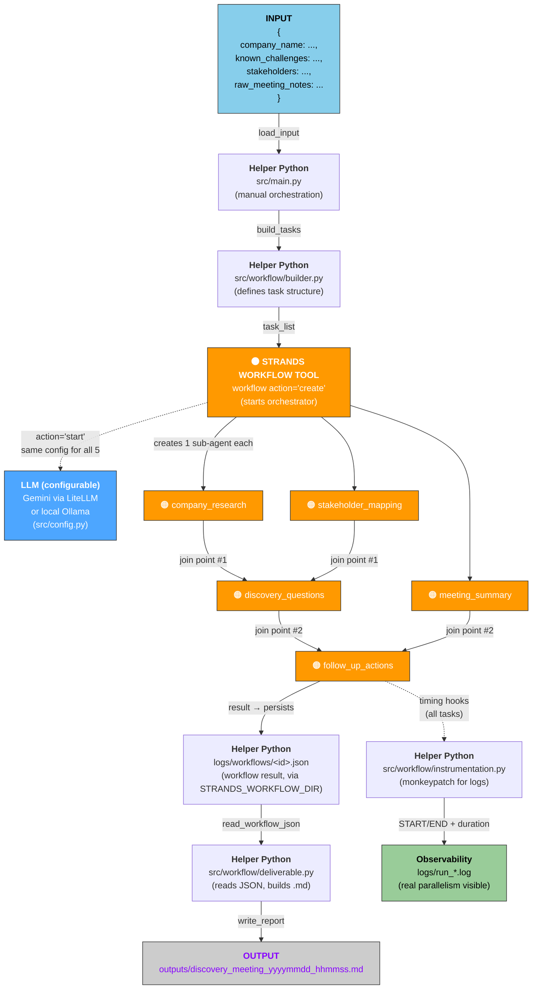

# Strands Agents - Patrón de Orquestación Workflow


## Introducción

Este es un ejemplo educativo del patrón de orquestación de **Agent Workflow** del framework Strands Agents. El Workflow tool es una herramienta de orquestación basada en **tareas con dependencias explícitas y resolución automática** — un grafo de tareas acíclico donde algunas tareas deben esperar el resultado de otras antes de poder ejecutarse, y donde varias tareas independientes pueden correr en paralelo hasta converger en puntos de agregación (*join points*). A diferencia de Graph, Workflow no está pensado para topologías cíclicas ni condiciones de enrutamiento entre nodos — su fuerte es la gestión operacional del pipeline: reintentos automáticos ante fallos, prioridad de ejecución, resolución de dependencias, entre otros.

Utilicé para probar Ollama-Gemma4 (via docker) y la capa gratuita de Gemini via api key.

### ¿Cuándo usar Workflow?

Reconocé el caso de uso para el patrón Workflow cuando tu problema tiene forma de **pipeline de tareas con dependencias**, más que de negociación entre agentes o de un grafo con lógica condicional compleja:

- Tu pipeline tiene una **estructura clara de dependencias explícitas**: algunos pasos necesitan el resultado de otros antes de poder ejecutarse (ej. no podés redactar preguntas de discovery sin research previo).
- Necesitás **paralelismo real** entre tareas independientes que después convergen en uno o más puntos de agregación (*join points*).
- Te interesa la gestión operacional del pipeline más que el enrutamiento: reintentos automáticos ante `ThrottlingException`, prioridad de ejecución (`priority`) entre tareas, tools/model_provider distintos por tarea.
- No necesitás ciclos ni revisión iterativa (feedback loops) — si tu flujo necesita eso, es un caso para **Graph**, no para Workflow.

❗ No es la mejor opción si el flujo requiere ciclos o condiciones de bifurcación explícitas entre pasos (ahí conviene **Graph**), si necesitás que los agentes negocien dinámicamente quién hace qué (ahí conviene **Swarm**), o si alcanza con que un agente delegue tareas puntuales sin dependencias complejas (ahí alcanza con **Agents-as-Tools**).

## Caso de uso: Prepare & Manage meeting as a Solution Architect

Se me ocurrió usar un playground de una app de PartyRock ayuda a un Solutions Architect a prepararse y cerrar un discovery meeting con un cliente. Rediseñé las dependencias para formar un workflow creando un pipeline de 5 tareas con **paralelismo real y dos *join points***:

```
company_research ──────┐
                       ├──→ discovery_questions ──┐
stakeholder_mapping ───┘                          ├──→ follow_up_actions
                                                  │
meeting_summary ──────────────────────────────────┘
```

`company_research`, `stakeholder_mapping` y `meeting_summary` no dependen entre sí, así que las tres corren en paralelo. `discovery_questions` es el primer *join point*: espera a que terminen research + stakeholder mapping, y genera preguntas de discovery fundamentadas en ese contexto real (no preguntas genéricas). `follow_up_actions` es el *join point* final: compara lo que se planeó preguntar contra lo que realmente pasó en la reunión (`meeting_summary`), y arma un entregable real — email de seguimiento, próximos pasos, y gaps (preguntas planeadas que nunca se llegaron a tocar).

> App de PartyRock original [Prepare & Manage meeting as a Solution Architect](https://partyrock.aws/u/jfescott/CkWsGSARh/Prepare-and-Manage-meeting-as-a-Solution-Architect) de Jeff Scott. 

## Estructura del proyecto

``` plaintext
strands-workflow/
├── README.md
├── requirements.txt                  # strands-agents[litellm,ollama], strands-agents-tools, pydantic, pytest
├── .env.example                      # MODEL_PROVIDER, GEMINI_API_KEY, OLLAMA_MODEL_ID
├── .gitignore
├── pytest.ini                        # pythonpath=. so tests/ and evals/ resolve src./config imports
│
├── src/
│   ├── __init__.py
│   ├── config.py                     # get_model_config(): single global provider (Gemini or Ollama) via MODEL_PROVIDER env var
│   ├── main.py                       # Entry point: builds tasks, creates+starts the workflow, assembles the final .md
│   │
│   ├── agents/
│   │   ├── __init__.py
│   │   └── prompts.py                # System prompts per task_id (company_research, stakeholder_mapping, etc.)
│   │
│   ├── workflow/
│   │   ├── __init__.py
│   │   ├── builder.py                # build_tasks(): builds the task list — task_id, dependencies, priority
│   │   ├── deliverable.py            # Reads the persisted workflow JSON and assembles the final .md
│   │   └── instrumentation.py        # Timing hook: logs START/END + duration per task
│   │
│   ├── models/
│   │   └── schemas.py                # Pydantic: DiscoveryMeetingInput
│   │
│   └── utils/
│       ├── logging_config.py         # Tees stdout+stderr to logs/, optional DEBUG level
│       └── report_export.py          # Writes the final .md to outputs/
│
├── tests/
│   ├── __init__.py
│   ├── test_config.py                # get_model_config(): provider resolution + error if API key is missing
│   ├── test_workflow_structure.py    # Validates the workflow is well-formed: no cycles, existing dependencies, correct join points
│   ├── test_schemas.py               # Pydantic validation of DiscoveryMeetingInput
│   ├── test_report_export.py         # Generates the .md from a mocked workflow JSON
│   └── test_instrumentation.py       # Verifies install_task_timing_hooks() logs START/END with duration, without calling a real LLM
│
├── examples/
│   └── sample_input.json             # Sample input to run the workflow quickly
│
├── evals/
│   ├── __init__.py
│   ├── evaluate_workflow.py          # strands-evals runner: OutputEvaluator + HelpfulnessEvaluator + deterministic metrics
│   ├── metrics.py                    # Domain metrics: task completion rate, join point coverage, required sections, stakeholder coverage, keyword presence
│   └── test_cases/
│       └── workflow_eval_cases.json  # Input + expected properties per eval case
│
├── logs/
│   └── .gitkeep                      # logs/run_<timestamp>.log, gitignored otherwise
│
└── outputs/
    └── .gitkeep                      # .md generated per run, gitignored otherwise

```

## Cómo funciona

Lo primero a decidir es con qué proveedor correr el workflow. En `src/config.py` se elige **un único provider para toda la corrida** (no uno distinto por tarea) vía la env var `MODEL_PROVIDER` (`ollama` o `gemini`): el objetivo educativo de este proyecto es que puedas aprender el patrón de orquestación en sí (dependencias, paralelismo, *join points*) sin necesitar cuenta de AWS ni gastar en modelos cloud. Migrar a un setup con providers distintos por rol queda como paso futuro.

### `src/main.py`

Carga `.env` con `python-dotenv` (`load_dotenv()`) **antes** de importar `src.config` — importa en ese orden exacto, porque `src/config.py` lee las env vars al nivel de módulo, apenas se importa. Si `load_dotenv()` corriera después, las variables de `.env` nunca llegarían a tiempo. Por default, el estado persistido del workflow (`~/.strands/workflows/`) se redirige a `logs/workflows/` vía `STRANDS_WORKFLOW_DIR` en `.env.example`, para tener todo lo de una corrida (log + workflow JSON + `.md` final) agrupado bajo el mismo proyecto en vez de disperso en el home del usuario.

Si `MODEL_PROVIDER=gemini`, setea `STRANDS_WORKFLOW_MAX_THREADS=1` **antes** de importar `strands_tools` (mismo motivo de orden que con `load_dotenv()` — la env var se lee una sola vez, al importar el módulo). Ver la limitación de `module_level_aclient`/LiteLLM más abajo — este es el workaround aplicado.

### `src/config.py`

- **`get_model_config()`** devuelve el par `model_provider` + `model_settings` que se inyecta en las 5 tasks por igual (`**model_cfg` en `builder.py`).
- **Gemini no es un provider nativo de `strands_tools.create_model`** (verificado con test). El dispatcher interno solo soporta `bedrock`, `anthropic`, `litellm`, `llamaapi`, `ollama`, `openai`, `writer`, `cohere`, `github`. La solución es rutear Gemini vía **LiteLLM** (`model_provider="litellm"`, `model_id="gemini/<modelo>"`), que sí lo soporta nativamente.
- **`OllamaModel` y `LiteLLMModel` no aceptan un dict `params` anidado** — otro detalle verificado en runtime (`UserWarning: Invalid configuration parameters: ['params']`). Los parámetros van planos: `temperature`, `max_tokens`, `options`, etc.
- **`max_tokens` explícito es importante**: sin él, tareas con contexto largo (como `discovery_questions`, que concatena los outputs completos de dos tareas previas) pueden cortarse a mitad de generación. Esto aplica solo con **Ollama** (`max_tokens` plano, sí se respeta). Con **Gemini/LiteLLM**, el mismo parámetro queda ignorado silenciosamente.


### `src/agents/prompts.py`

Los `system_prompt` de `company_research`, `discovery_questions` y `meeting_summary` están adaptados de los prompts originales de la app de Jeff Scott en PartyRock, reescritos para encajar como `system_prompt` de Strands. `stakeholder_mapping` y `follow_up_actions` no tienen equivalente en la app original — son tareas nuevas, necesarias para que existan los *join points* del workflow.

### `src/workflow/builder.py`

`build_tasks()` arma la lista de 5 `task` dicts que consume la tool `workflow`. El Workflow Tool usa estos campos para resolver dependencias y ejecutar tareas en orden correcto:
- `task_id`: identificador único de la tarea
- `description`: instrucciones (el Workflow Tool inyecta aquí el contexto de tareas dependientes automáticamente)
- `system_prompt`: rol/instrucciones del LLM
- `dependencies`: lista de task_ids que deben completarse (`status="completed"`) antes de ejecutar esta tarea
- `priority`: determina orden de ejecución entre tareas ready
- `"tools": NO_TOOLS`: restricción para que el sub-agente no herede la tool workflow

Todas comparten el mismo `model_provider`/`model_settings` vía `**model_cfg`, inyectado desde `src/config.py`.

`NO_TOOLS` (`["__no_tools__"]`) corrige un bug en ejecución real: por default, cada sub-agente de una task **hereda todas las tools del agente padre**, incluida la propia `workflow`. Con un modelo agéntico (probado con gemini-3.5-flash-lite), esto llevó a que el sub-agente de `company_research` **llamara recursivamente a `workflow`**, creando un segundo workflow anidado con tasks mal formadas (sin `model_provider`), que terminaron cayendo al fallback silencioso a Bedrock sin credenciales (ver limitación abajo). `"tools": []` (lista vacía) **no alcanza** para bloquear la herencia — es *falsy* en Python, así que igual cae al fallback que hereda todo. La solución es pasar un nombre placeholder que no matchee ningún tool real, forzando `filtered_tools` a quedar vacío.

### `src/workflow/deliverable.py`

Ni `action="start"` ni `action="status"` de la tool `workflow` devuelven el texto real generado por cada tarea:
- `start` devuelve solo un resumen (`"🎉 Workflow completed... (5/5 tasks succeeded)"`)
- `status` arma una tabla Rich con el estado, no con el contenido

**¿Dónde está entonces el resultado real de cada tarea?** Solo en el JSON que la tool persiste en disco, en la ruta que definís con `STRANDS_WORKFLOW_DIR` (por default, `~/.strands/workflows/`; en este proyecto la redirigimos a `logs/workflows/` — ver `.env.example`), bajo la clave `task_results[task_id]["result"]`.

Por eso existe `deliverable.py`: lee ese JSON directamente y arma el `.md` final combinando las 5 secciones del pipeline (research, stakeholder mapping, meeting summary, y los dos *join points*).

### `src/workflow/instrumentation.py`

El comportamiento de la workflow tool trackea el horario de inicio de cada tarea **solo en memoria** (`task_executor.start_times`), y nunca lo loguea ni lo persiste — solo se usa internamente para calcular la duración que se muestra en la tabla de `action="status"`. No hay ningún hook público expuesto por la tool para observar esto desde afuera. `install_task_timing_hooks()` resuelve esto con un monkeypatch (en código propio del proyecto, sin tocar el paquete instalado) sobre `WorkflowManager.execute_task`, logueando una línea `▶ START` y otra `⏹ END` con timestamp exacto y duración por tarea. Clave para poder analizar en el log si el paralelismo declarado en el workflow se está traduciendo en paralelismo real de ejecución.

### `src/utils/logging_config.py`

`tee_console_to_file()` redirige tanto `stdout` como `stderr` a `logs/run_<timestamp>.log`. El módulo `logging` de Python escribe a **stderr** por default, así que un tee que solo cubra `stdout` pierde silenciosamente todas las líneas `logger.info/debug/error` de `strands_tools.workflow` — que es lo más útil para analizar qué hizo el workflow en cada corrida. El tee también incluye un `threading.Lock` alrededor de cada `write()` — necesario cuando `OLLAMA_NUM_PARALLEL > 1` hace que múltiples tasks corran en paralelo y emitan tokens simultáneamente: sin el lock, los writes de distintos threads se intercalan carácter a carácter, produciendo output ilegible tanto en consola como en el log.

## Arquitectura — Strands Workflow Tool vs Python Auxiliar

El flujo del proyecto hace una **separación clara entre qué hace la Strands Workflow Tool y qué hace código Python**:



### 🟠 Strands Workflow Tool — ¿Qué hace?

- **Crea** el workflow con `action="create"` → valida estructura de tareas, persiste metadata
- **Ejecuta** con `action="start"` → paraleliza tareas según `dependencies`, reintenta fallos automáticamente, trackea estado en JSON
- **Resolución de dependencias**: internamente chequea `status == "completed"` de cada dependencia para marcar una tarea como "ready"
- **Context passing automático**: inyecta el output de tareas dependientes en el `description` de la tarea que las necesita
- **Estado persiste** en `~/.strands/workflows/<workflow_id>.json` — accesible fuera de la tool

**Lo que se encarga Strands:**
- Dependency resolution automática (quién corre después de quién)
- Real parallelism (tareas independientes en threads separados)
- Retry automático ante fallos transitorios
- Priorización (`priority` field)
- Resolución de status (`pending` → `ready` → `running` → `completed`/`error`)

**Lo que Strands NO expone (responsabilidad del proyecto):**
- Acceso al resultado textual de cada tarea → hay que leerlo directamente del JSON (`deliverable.py`)
- Observabilidad de timing per-task → se instalan hooks propios (`instrumentation.py`)
- Configuración de modelo por task → decisión de este proyecto: un único provider para toda la corrida (`config.py`)

### Python Auxiliar — ¿Qué hace?


| Componente | Responsabilidad |
|---|---|
| **src/main.py** | Entry point, secuencia manual (load → build → create → start → deliver → cleanup) |
| **src/workflow/builder.py** | Arma la task list (Strands consume `List[Dict]`, nosotros los construimos) |
| **src/workflow/deliverable.py** | Lee el JSON del workflow, formatea markdown (Strands no lo hace) |
| **src/workflow/instrumentation.py** | Monkeypatch para loguear START/END per-task (Strands no expone hooks públicos) |
| **src/config.py** | Global provider config (Strands consume `model_provider` + `model_settings`, nosotros los inyectamos) |
| **src/agents/prompts.py** | System prompts por task (Strands consume strings, nosotros los escribimos) |


### Limitaciones verificadas de `workflow` (v0.8.6)

Hallazgos verificados en código y en ejecuciones reales:

- **`pause`/`resume` no están implementados**, pese a que la documentación oficial de Strands los promete como *Advanced Feature*. Verificado corriendo ambas acciones sin ningún LLM de por medio: devuelven `{"status": "error", "content": [{"text": "🚧 Action '...' is not yet implemented"}]}`. Confirmado también que el archivo fuente del paquete instalado (`pip install strands-agents-tools==0.8.6`) es **idéntico byte a byte** al que se ve en el repo — no es un problema de versión desactualizada, es una discrepancia real entre documentación e implementación.
- **Cualquier task con acceso a la propia tool `workflow` puede invocarla recursivamente.** No es un bug de la implementación del framework en sí, sino de la combinación herencia-de-tools-por-default + modelos agénticos: si no restringís explícitamente `"tools"` por task, cada sub-agente hereda todo el toolset del padre, incluida `workflow`. Con Gemini 3.5 esto disparó una llamada recursiva real que creó un workflow anidado y terminó crasheando. Mitigado en este proyecto con la constante `NO_TOOLS` en `builder.py` — no es una solución oficial de la librería, es un workaround.
- **Si una tarea falla, el workflow puede quedar colgado para siempre en vez de fallar explícitamente.** `get_ready_tasks()` exige que el `status` de cada dependencia sea literalmente `"completed"` para considerar lista a una tarea dependiente. Si una tarea termina con `status: "error"` (por ejemplo, por truncamiento de `max_tokens`, o por el problema de arriba), sus dependientes nunca se vuelven "ready", pero el loop principal (`while len(completed_tasks) < total_tasks`) tampoco corta la ejecución — sigue girando indefinidamente con `time.sleep(0.1)`. Verificado en ejecución real: hubo que cortar el proceso a mano.
- **LiteLLM (usado para Gemini) tiene un schema de configuración distinto al de Ollama.** `OllamaConfig` acepta `temperature`/`max_tokens` planos; `LiteLLMConfig` solo valida `context_window_limit`, `model_id`, `params`, `stream` — pasar `temperature`/`max_tokens` planos genera un `UserWarning` y **esos parámetros quedan ignorados silenciosamente** (Gemini corre con sus defaults propios).
- **Con Gemini/LiteLLM y paralelismo real, el proceso puede crashear de forma intermitente — no es específico de Windows.** Verificado con traceback real: `asyncio.exceptions.CancelledError` dentro de `aiohttp`, con `RuntimeError: ... attached to a different loop`. Causa raíz confirmada en el issue tracker de LiteLLM (BerriAI/litellm **#7667** y **#24230**, ambos abiertos): `litellm.module_level_aclient` — el cliente HTTP async compartido específicamente para streaming de Vertex/Gemini — es un **singleton global creado una sola vez al importar `litellm`**, y a diferencia del resto de la caché de clientes de LiteLLM (que sí incorpora el `id()` del event loop en su key, ver `LLMClientCache.update_cache_key_with_event_loop`), este objeto puntual **no es loop-aware**. `workflow.py` corre cada task en su propio thread, y cada thread crea su propio `asyncio.run()` — con 2+ tasks usando LiteLLM en paralelo, compiten por ese mismo cliente global y crashea. Confirmado que **también ocurre en WSL2/Linux**, no solo en Windows nativo (se había asumido erróneamente lo contrario en una versión anterior de este README, basado en una sola corrida exitosa — dato insuficiente).
  **Workaround aplicado en este proyecto**: El framework Strands expone `STRANDS_WORKFLOW_MAX_THREADS` (env var leída una sola vez, al importar el módulo). Seteándola en `1`, el `ThreadPoolExecutor` interno nunca corre 2 tasks en threads distintos al mismo tiempo, así que la condición de carrera nunca se da. Se aplica **automáticamente y solo si `MODEL_PROVIDER=gemini`** (ver `src/main.py` y `evals/evaluate_workflow.py`) — con Ollama no hace falta, no usa el transport `aiohttp` de LiteLLM. Costo: se pierde el paralelismo real de la Fase 1 al usar Gemini (las 3 tasks corren en serie, igual que Ollama sin `OLLAMA_NUM_PARALLEL`).


## 💻 Ejecución Local

### 1. Requisitos Previos e Instalación

El proyecto está en Python y se requiere mínimo **Python 3.12 o superior**.

1. Clonar el repositorio:

```bash
git clone https://github.com/reinalau/strands-workflow
cd strands-workflow
```

### 2.1. Requisito para ejecución con la API de Gemini

Ingresar con una cuenta de Gmail a https://aistudio.google.com/ y generar una API key:

https://aistudio.google.com/api-keys

La capa gratuita se puede utilizar con:
gemini-2.5-flash-lite
gemini-2.5-flash
gemini-3.5-flash
gemini-3.5-flash-lite

### 2.2. Requisito para ejecución con Docker - Ollama y gemma4:e2b-it-qat

1. Tener Docker Desktop instalado y corriendo.

2. **Primera vez:** crear y levantar el servidor de Ollama con un volumen persistente:

```bash
docker run -d --name ollama -p 11434:11434 -v ollama_data:/root/.ollama ollama/ollama
```
*(Si el contenedor ya fue creado previamente y está detenido, alcanza con `docker start ollama`)*

> **Nota sobre paralelismo real:** por default, Ollama procesa un request de inferencia a la vez (`OLLAMA_NUM_PARALLEL=1`), aunque Strands sí envíe las 3 tareas paralelas del DAG al mismo tiempo. Si querés que el paralelismo declarado en el workflow se traduzca en ejecución concurrente real (y no en tareas encoladas), recreá el contenedor con la variable seteada:
> ```bash
> docker stop ollama && docker rm ollama
> docker run -d --name ollama -p 11434:11434 -v ollama_data:/root/.ollama -e OLLAMA_NUM_PARALLEL=3 ollama/ollama
> ```
> Tené en cuenta que esto multiplica el uso de RAM/VRAM.

3. Descargar el modelo (solo la primera vez; con el volumen montado, queda guardado):

```bash
docker exec -it ollama ollama pull gemma4:e2b-it-qat
```

4. Probar que el modelo responde interactivamente:

```bash
docker exec -it ollama ollama run gemma4:e2b-it-qat
```
Interactuar diciendo al menos "hola" y verificar si contesta. Para salir presionar `Ctrl + d` o escribir `/bye`.

5. Verificar que el modelo está activo en memoria:

```bash
docker exec -it ollama ollama ps
```

### 3. Instalación Requerimientos

Se recomienda revisar `requirements.txt` e instalar solo lo necesario para el modelo elegido.

1. Entorno virtual e instalación:
```bash
pip install -r requirements.txt
```

2. Variables de entorno:
```bash
cp .env.example .env
```
Editar `MODEL_PROVIDER` (`ollama` o `gemini`) y, si corresponde, `GEMINI_API_KEY`.

### 4. Pruebas unitarias (`tests/`)

La explicación de cada test está en el apartado "Cómo funciona". Ninguno necesita un LLM real ni conexión a Ollama/Gemini — corren en menos de un segundo.

Se ejecutan por defecto:

```bash
python -m pytest
```

### 5. EJECUCIÓN REAL DEL WORKFLOW

Se puede ejecutar contra el modelo Ollama local o vía API de Gemini. Se configura en `.env`. Revisar valores default en `src/config.py`.

Al correr `python -m src.main --debug`, vas a ver en la consola en tiempo real cómo se crean y arrancan las 5 tareas, las líneas `▶ START`/`⏹ END` de `instrumentation.py` con timestamp y duración de cada una (útil para confirmar si el paralelismo de la Fase 1 se tradujo en ejecución concurrente real o en tareas encoladas — ver nota sobre `OLLAMA_NUM_PARALLEL` más arriba), y el mensaje final con el resumen de tareas completadas. Al terminar, el `.md` final queda en `outputs/` con las 5 secciones del pipeline, incluyendo ambos *join points*.

```bash
python -m src.main --debug
```

O podes ejecutar con estos argumentos opcionales:
```bash
python -m src.main --input examples/sample_input.json --workflow-id mi_corrida --debug
```

### 6. Ejecución de Evaluación de Comportamiento (`evals/`)

El proyecto usa el framework oficial **`strands-agents-evals`** con el mismo provider configurado en `.env` (Gemini u Ollama) como juez — sin necesidad de Amazon Bedrock.

```bash
python -m evals.evaluate_workflow
```

#### 6.1 Evaluadores y métricas

Dos tipos de evaluación corren sobre cada caso:

**LLM-as-a-judge (`strands-agents-evals`)**

| Evaluador | ¿Qué evalúa? | Escala |
|---|---|---|
| **`OutputEvaluator`** | Verifica que `follow_up_actions` tenga las 3 secciones obligatorias (email, next steps, gaps) y que el contenido esté fundamentado en los datos reales de la reunión. | 0 / 0.5 / 1 |
| **`HelpfulnessEvaluator`** | Evalúa si el entregable final es genuinamente útil para un Solutions Architect — no solo si tiene el formato correcto. Es una instancia de OutputEvaluator con rubric propio, no una clase separada del SDK! | 0/0.5/1 |

**Deterministas (`evals/metrics.py`)** — miden propiedades estructurales del patrón Workflow, sin llamadas a LLM:

| Métrica | ¿Qué mide? |
|---|---|
| **`task_completion_rate`** | Fracción de tasks que completaron con `status="completed"` en el JSON persistido. Un task en `error` bloquea sus dependientes (limitación documentada). |
| **`join_point_coverage`** | Verifica que ambos *join points* (`discovery_questions`, `follow_up_actions`) produjeron output no vacío — confirma que la inyección de contexto funcionó. |
| **`required_sections`** | Check determinista de que `follow_up_actions` contiene las 3 secciones del entregable (email, next steps, gaps). |
| **`stakeholder_coverage`** | Verifica que cada stakeholder del input aparece en `discovery_questions` — confirma que el contexto de `stakeholder_mapping` llegó al *join point* #1. |
| **`keyword_presence`** | Presencia de keywords de dominio en `company_research` y `follow_up_actions` — chequeo de regresión ante drift de prompt. |

#### 6.2 Estructura de `evals/`

```plaintext
evals/
├── __init__.py
├── evaluate_workflow.py          # Runner principal: Experiment + evaluadores + métricas deterministas
├── metrics.py                    # task_completion_rate, join_point_coverage, required_sections,
│                                 # stakeholder_coverage, keyword_presence
└── test_cases/
    └── workflow_eval_cases.json  # Casos con input + propiedades esperadas anotadas
```

**Nota sobre el modelo judge:** los evaluadores LLM-as-a-judge (`OutputEvaluator`, `HelpfulnessEvaluator`) usan el mismo provider y modelo configurado en `.env` — tanto para generar el output del workflow como para evaluarlo. En producción la práctica estándar es usar un modelo más capaz como judge (ej. el workflow corre con `gemini-2.0-flash` y el judge usa `gemini-2.5-pro`). Acá se unifica por simplicidad y para mantener el constraint de free tier / local sin AWS.

**Nota sobre ejecución con Gemini:** el eval runner ejecuta el workflow real. Ver la limitación de `module_level_aclient`/LiteLLM documentada arriba — el mismo workaround (`STRANDS_WORKFLOW_MAX_THREADS=1`) se aplica automáticamente en `evaluate_workflow.py` cuando `MODEL_PROVIDER=gemini`. Con Ollama no hace falta.

El reporte completo de las evaluaciones queda en `outputs/eval_report_<timestamp>.json`.

### 7. ⚠️ Si una corrida falla (main o evals)

Si `python -m src.main` o `python -m evals.evaluate_workflow` se cortan por un error (cualquiera de los documentados arriba, o si lo cancelás vos con `Ctrl+C`), el workflow puede quedar en un estado a medio terminar, persistido en disco. **Borralo antes de reintentar**, o el próximo `action="create"` con el mismo `workflow_id` puede chocar con ese estado huérfano:

```bash
# ruta configurada en STRANDS_WORKFLOW_DIR (.env.example) — por default en este proyecto:
rm logs/workflows/discovery_meeting.json      # para src/main.py
rm logs/workflows/eval_*.json                 # para evals/evaluate_workflow.py
```

Si nunca configuraste `STRANDS_WORKFLOW_DIR`, la ruta default de la librería es `~/.strands/workflows/<workflow_id>.json`.


## Trabajo Futuro

Se puede extender el proyecto encadenando el output del workflow como entrada de un nuevo agente que genere diagramas de arquitectura AWS sugeridos a partir del entregable final. El patrón resultante combinaría **Workflow** (pipeline de 5 tasks) con un agente secuencial que consume ese output y produce un diagrama via MCP de draw.io.

Realicé una POC funcional para probar el MCP en `strands-drawio-poc/` — verificada con Gemini. La limitación conocida es que con Ollama/gemma4 la app de draw.io no se abre para mostrar el gráfico, por lo que queda pendiente de resolución antes de integrarlo al flujo principal.


## Referencias

- [Strands Agents — Documentación oficial](https://strandsagents.com/)
- [Strands Agents — Multi-agent patterns](https://strandsagents.com/latest/user-guide/concepts/multi-agent/)
- [Workflow MultiAgents](https://strandsagents.com/docs/user-guide/concepts/multi-agent/workflow/)
- [Strands Agents Evals — Quickstart](https://strandsagents.com/docs/user-guide/evals-sdk/quickstart/)
- [strands-agents/tools — workflow.py (código fuente)](https://github.com/strands-agents/tools/blob/main/src/strands_tools/workflow.py)
- [Prepare & Manage meeting as a Solution Architect (PartyRock, por Jeff Scott)](https://partyrock.aws/u/jfescott/CkWsGSARh/Prepare-and-Manage-meeting-as-a-Solution-Architect)
- [gemma4:e2b-it-qat](https://ollama.com/library/gemma4)
- [Artículo relacionado](https://builder.aws.com/content/3Hv0A1JrHbwfgzEktts2k0Z1FeO/workflow-en-strands-un-dag-de-tareas-ejecutado-como-herramienta-unica)


## Licencia

Este proyecto está bajo la Licencia MIT. Consultá el archivo [LICENSE](LICENSE) para más detalles.